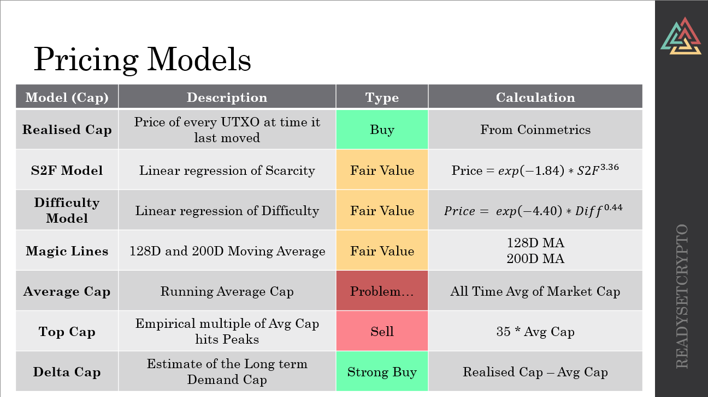
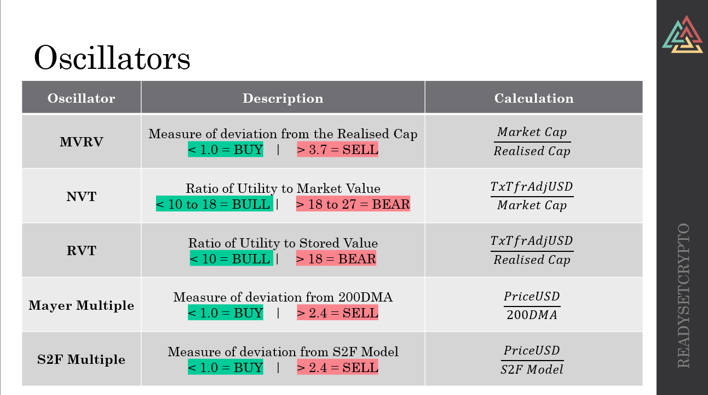
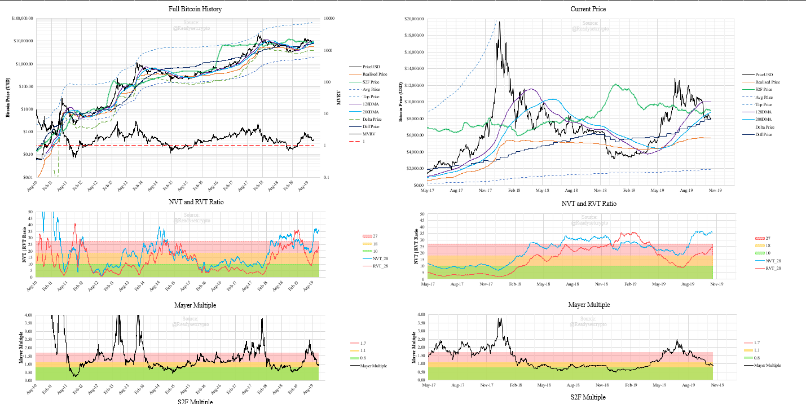
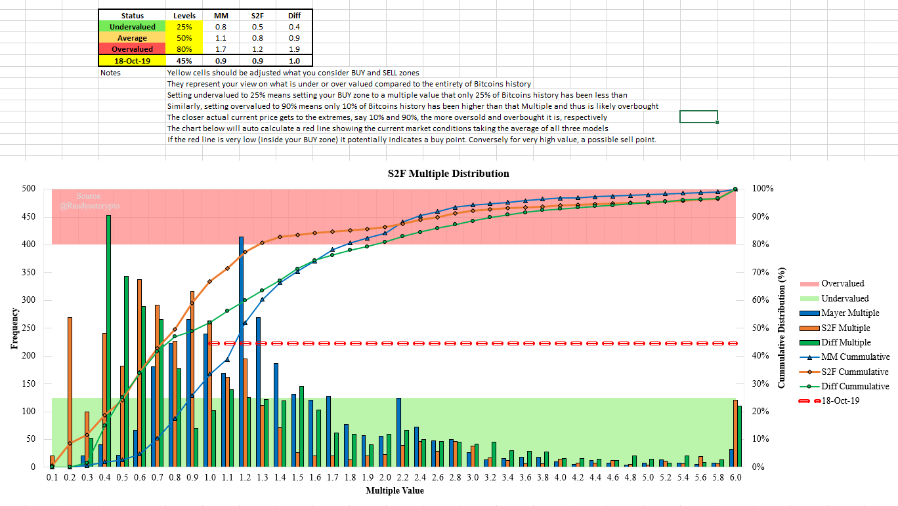

# ReadySetCrypto Onchain_Analysis
Developing an RSC Toolkit for On-chain analysis for Blockchains

# Spreadsheet Features v1.0.0

## **Pricing models**
The following pricing models are built in to the sheet

## **Oscillators**
The following oscillators are built in to the sheet

## **Charting Package**
Pre-setup charts are avaialble for 
- Full Bitcoin History
- Zoomed in to past 24 Months

## **Model Multiple Distributions**
The histograms for the Mayer Multiple, S2F Multiple and Difficulty Multiple are plotted out along with the cummulative distribution profile (CDP).

These show the frequency and CDP throughout the entireity of Bitcoins history and can be used to estimate how far away from the model price BTCUSD currently is (red line).

Some general pointers:
- Below 20% means only 20% of Bitcoins history has been this far **below** the model price --> Possibly Undervalued
- Above 80% means only 20% of Bitcoins history has been this far **above** the model price --> Possibly Overvalued
- Value of 50% means price is at the average multiple value --> Fairly Priced

The yellow boxes in the table at the top can be adjusted for the following:
- Levels you consider Undervalued, Average and Overvalued.
- Date you wish to inspect the relationship at that time.

The white cells calculate from the actual data what Multiple value fits your selected levels. The green, yellow and red zones on the charting page will adjust accordingly for each relevant Multiple plot.

## References

[Articles covering various elements for RSC Members](https://github.com/readysetcryptocodes/Onchain_Analysis/tree/master/articles)

[Video back in late June 2019 indicating potential bearish future](https://www.youtube.com/watch?v=NQOO5Z063zg).

