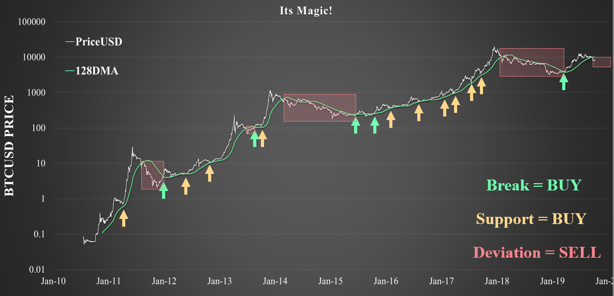
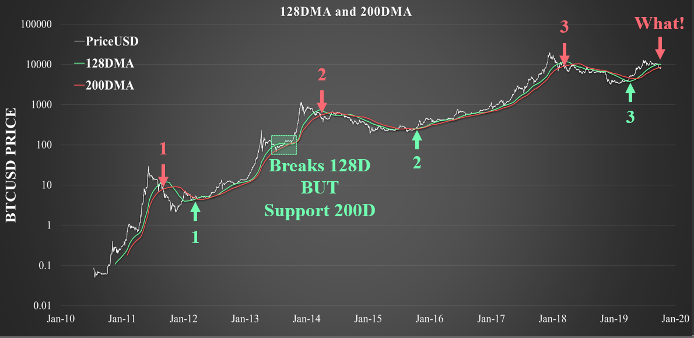
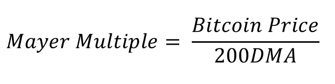
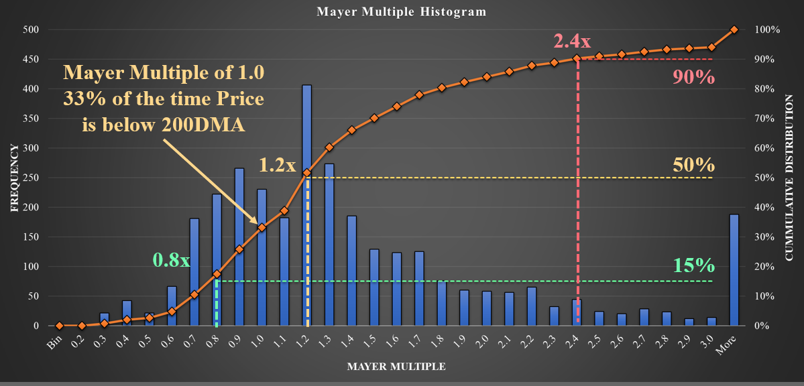
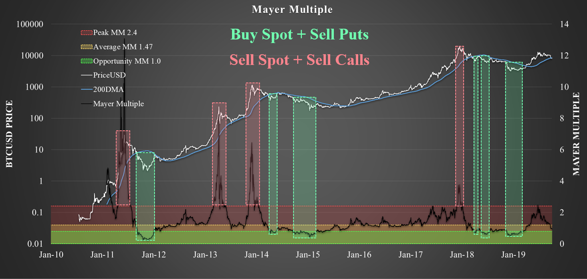
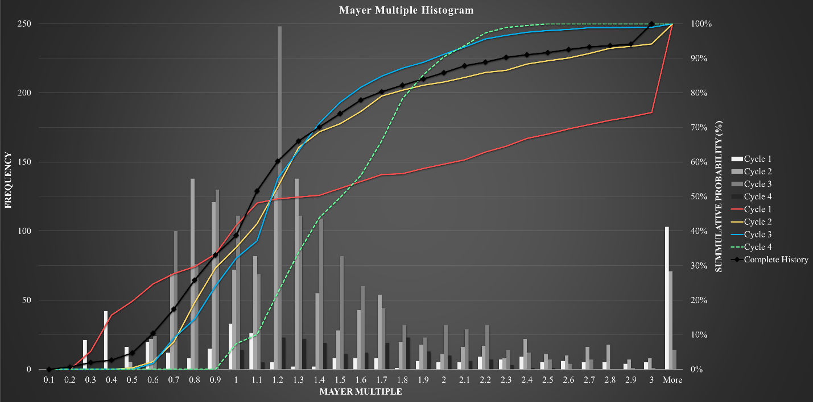

# Bitcoin's Magic Lines and the Mayer Multiple
by Checkmate
13 Oct 2019

Bitcoin trading and investing is not for the feint of heart. As we all know, the asset is subject to extreme price volatility as a result of it’s fixed supply, radically new technology and globally unregulated market status. Arguably, Bitcoin is the first truly free market since the monetisation of gold through human history (which is now so heavily regulated it is impossible to call it free).

What this means for investors is that wild price swings of 20% in a day are not just uncommon but to be expected. Now whilst this volatility is great for traders, it can be overwhelming for the casual investor. It takes a level of philosophical commitment and belief in the asset to properly stomach such large swings in portfolio value.

What I want to introduce today are three very simple analysis tools that can take the vast majority of  stress out of the Bitcoin market. These tools rely on the simple theory of probability coupled with the goal to buy low and sell high. If your goal is to capture the bulk of the Bitcoin bull run, these are potentially the only tools you need.

The signals covered today are the 200 and **128 day moving average** and the **Mayer Multiple**.

## Bitcoin's Magic Line
For those of you who have read Insider Buy Superstocks by Jessie Stein, you will be familiar with the concept of a stock’s magic line. For those who have not read this book, it is a masterpiece of simplicity and distils an immense amount of complexity in understanding charts into a simple set of rules. I highly recommend it.

Stein identified for traditional equities that when the chart resembles what he calls a ‘superstock’ there are a set of criteria that indicate the stock is ready for a significant advance. Interestingly, the Daily chart of Bitcoin and the Weekly chart of Gold resembled superstocks in the first quarter of 2019. Assets which have had a significant bubble pop, followed by a long and painful bear market. At the end of this process, only the strongest and most faithful investors remain. There are literally no sellers left.

A superstock chart resembles a bubble which has popped and returned to a long and stable basing pattern which is eventually broken by a swift move to the upside on strong volume. Stein notes that in traditional equities, this line is often the 30Week Moving average.

Upon breaking through the 30week MA on strong volume, the stock often becomes of interest to momentum and swing traders who now jump on board and push the price up to nosebleed levels before exiting the building. The asset price chart usually advances with an angle of attack greater than 45 degrees indicating strong buy demand.

During this price advance, each stock usually has what Stein calls its ‘magic line’ which is usually close to the 30W MA. This magic line is a simple moving average which the asset returns to on a semi-regular basis, touch the line and then proceed upwards with strength throughout the bull market run. Eventually, the magic line must fail as support and thus the traders bias must be flipped to the downside.

This topping pattern usually follows the stock leaving the Magic line and accelerating away from it in a steep angle of attack. Very much in line with a blow-off top as things go parabolic and reach euphoria.

I am quite convinced that the 128DMA is Bitcoins magic line (however it may change over time as the market matures). If you bought with both fists when BTC breaks the 128DMA on volume and topped up every time it touched the line, you would outperform every single bull market to date. The sell signal comes when price drops below the magic line and cash is a position until a clean break at the end of a bear.

## The 200 Day Moving Average
Now to step up the technical prowess a notch, we will add to our arsenal an even more complex indicator…the 200DMA. Stay with me…

It’s just a slower and higher conviction signal, there is really not much more to it with the exception that price REALY IS in a bear market when it cuts below it. In particular the 2013 fake-out bear cut below the 128DMA but was supported by the 200DMA. 

Historically, Bitcoin has only ever broken above and below the 200DMA once each in a full Bull-Bear cycle. As of today, price has broken below both the 128DMA and 200DMA which is unprecedented in a bull market. Uncharted territory.

## The Mayer Multiple
So we now have two extremely complicated yet incredibly high conviction signals that help us buy low and sell high. What we can now do is put some statistical and mathematical rigor to these systems to help identify when prices are undervalued and when they are overvalued.

Simply put:
1)	When Price is below the 128DMA and/or 200DMA it is bearish
2)	When price is above the 128DMA and/or 200DMA it is bullish
3)	When price returns to either line in a bull, it is a buy signal
4)	When price cuts below both either line it is a sell signal

In particular, the 200DMA has shown to be a long term support level during bullish periods. Trace Mayer who is an early Bitcoin investor originally developed what became known as the Mayer Multiple which is simply the ratio between Price and the 200DMA of price. 

We can apply some probability and mathematical rigor to this analysis by calculating how often price is above or below the 200DMA. The chart below is a histogram of the Mayer Multiple where any value below 1.0 represents time price was under the 200DMA. 

We can establish a few interesting statistics:

*15% of the time the Mayer Multiple is at 0.8x meaning Bitcoin trades at a 20% discount to the 200DMA. This could even be pushed to a Mayer Multiple of 0.7x at a 10% probability.

- 33% of the time the Bitcoin Price is below the 200DMA meaning it spends a third of its life in a bear market.

- 50% of the time the Mayer multiple is 1.2x meaning price is trading at a 20% premium to the 200DMA meaning that this is the average price range.

- 90% of the time the Mayer multiple is 2.4x or less meaning that only 10% of the time is price trading at 140% over the 200DMA.

When we think of the behaviour and role of the 200DMA (and 128DMA) as Bitcoins magic line, these statistics make intuitive sense. When price goes through a euphoric phase and blow through a Mayer multiple of 2.4x, it only remains there for a very show time before returning back to the mean. 

Similarly, when price dips below a Mayer multiple of 0.7x  or 0.8x, it only remains there for 10% and 15% of its life before springing back to the mean.

If you were to buy every time the Mayer Multiple dips below 0.8x and sell every time the Mayer multiple peaks above 2.4x, you would effectively be buying low and selling high. Statistically speaking, you will capture 80% of the entire market value over the long run.

In the same light, the Mayer Multiple can be invaluable in the toolkit of an options trader. That histogram above is a distribution of probabilities. It shows the historical probability that Bitcoin remains above or below a particular ratio with the 200DMA.

I have also separated out histograms and cumulative probability distribution (CPD) plots for each cycle in isolation. This considers the Mayer Multiple throughout each Bull-Bear cycle where I define the start and end point as the date when price breaks above the 200DMA ending the bear market.

What I am looking for here is consistency or development in the probability distribution over time. What is interesting is that the CPD for Cycle 2, 3, the complete history and Cycle 4 (today) are all approximately the same in shape. Since Cycle 4 is early in its history and technically has not undergone a bear market, it makes sense for low Mayer Multiple values (< 1.0) to be underweight at this time. Therefore I expect the green line to move to the left over time.

Under this light, the Mayer Multiple right now is 1.0 meaning that there is a 33% chance that price will remain in this location long term. In other words, it is more likely that price will move up in the medium term than keep going lower. This does not indicate short term price movement, the Mayer multiple is indicative of medium to long term behaviour over the full Bitcoin cycle.

## Closing thoughts
Hopefully these relatively simple tools are valuable and personally, I find the simplicity of these three metrics to be impressively undervalued considering how powerful they are. 

If you goal is the buy low and sell high, I really don’t see a great need for many more metrics than these three. Similarly, if selling options is your game, I strongly recommend running some similar calculations in excel (Coinmetrics has the data) as you can apply the same methodology to any metric you wish.

As always, just shout if you want to talk through the details of the Mayer Multiple in Discord! 
